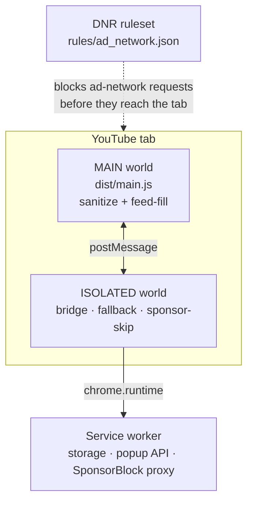

<p align="center">
  
</p>

# YTAF

Chrome / Edge **Manifest V3** extension that disables desktop YouTube ads, skips in-video sponsored segments, **hides Shorts**, and provides a **Premium-style play queue** (Play next / Add / reorder / auto-advance) without needing YouTube’s `TLPQ` playlist entitlement.

YTAF is built as a small teaching codebase for how modern YouTube clients deliver ads (Innertube JSON, player midrolls, Polymer feed tiles) and how an extension can intervene at each layer **without** the old MV2 `webRequest` blocking model.

---

## Quick start

```bash
./scripts/bundle.sh    # regenerate dist/* after src/ changes
```

1. Open `chrome://extensions`
2. Enable **Developer mode**
3. **Load unpacked** → select this `YTAF/` folder (needs a fresh `dist/` from `bundle.sh`)
4. Open or reload a YouTube watch tab

**Toggle:** action popup → **Enabled**. Reload the YouTube tab after changing.

---

## Why several layers?

YouTube ads are not one thing. They arrive through different surfaces, each with different privileges:

| Surface | Example | Who can touch it |
|---|---|---|
| Third-party ad tech | `doubleclick.net`, IMA SDK | Declarative Net Request (blocks before load) |
| First-party Innertube JSON | `player` / `next` / `browse` responses with `adPlacements` | **MAIN** world hooks (`fetch`, `JSON.parse`, …) |
| Live Polymer / Lit DOM | `ytd-ad-slot-renderer`, rich-item ads | **MAIN** DOM patching |
| Player chrome / enforcement UI | skip button, `ytd-enforcement-message-view-model` | **ISOLATED** + CSS |
| Crowdsourced sponsor segments | SponsorBlock API | Service worker proxy + ISOLATED skipper |

**MAIN** shares the page’s JavaScript realm, so it can see `ytInitialPlayerResponse` and patch `window.fetch`. It cannot call `chrome.*`.

**ISOLATED** can call `chrome.storage` / `chrome.runtime`, but cannot read page JS objects directly. A tiny `postMessage` bridge connects the two.



Manifest injection order matters:

1. `isolated-bridge.js` @ `document_start` — push config into the page early  
2. `main.js` @ `document_start` — install hooks before the first player JSON  
3. `isolated-fallback.js` @ `document_idle` — DOM fallbacks + sponsor skip  

---

## Repository layout

```
src/                         # editable modules (globalThis.YTAD namespace)
├── shared/                  # ns, constants, messaging helpers
├── schema/                  # Innertube keys, DOM selectors, URL helpers
├── main/sanitize/           # structure-preserving player/feed neuter + hooks
├── main/feed-fill/          # replace ad rich-items with organic clones
├── isolated/bridge.js       # storage ↔ MAIN; stats → service worker
├── isolated/fallback/       # hide enforcement UI; click leftover skip
├── isolated/sponsor-skip/   # SponsorBlock client, seek/mute, preview bar
├── isolated/shorts/         # hide Shorts DOM + /shorts → /watch redirect
├── isolated/queue/          # polished play queue (panel, tiles, auto-advance)
├── background/              # service worker source
└── popup/                   # action popup (loaded from src/, not bundled)

dist/                        # generated single-file entries (gitignored)
rules/ad_network.json        # declarativeNetRequest block rules
scripts/bundle.sh            # concatenate src/ → dist/
icons/icon-1024.png          # store / README artwork
```

Edit `src/`, then run `./scripts/bundle.sh`. The manifest always points at `dist/*`.

---

## Bundling: why single-file `dist/` bundles?

Chrome’s multi-file **MAIN-world** content-script injection was dropping modules in practice. YTAF therefore concatenates each realm into one IIFE:

| Output | Contents |
|---|---|
| `dist/main.js` | shared → schema → sanitize → feed-fill |
| `dist/isolated-bridge.js` | shared → bridge |
| `dist/isolated-fallback.js` | shared → schema → fallback + sponsor-skip |
| `dist/service-worker.js` | inlined `ns` + `constants` + worker body |
| `dist/fallback.css` | fallback + sponsor-skip styles |

Each source file is wrapped in `try/catch` so one failing module does not kill the whole bundle. `src/shared/ns.js` rebuilds `globalThis.YTAD` on inject and captures native `fetch` / `JSON.parse` once under `globalThis.__YTAD_NATIVES__` to avoid nested monkey-patches after extension reload.

---

## Technique 1 — Declarative Net Request

`rules/ad_network.json` blocks classic ad-network hosts and a few first-party ad telemetry paths (`pagead`, `api/stats/ads`, IMA, DoubleClick, syndication, …) at the network layer.

This is cheap and early, but **incomplete**: YouTube also embeds ad metadata inside Innertube JSON that never hits those hosts. First-party ads are handled in MAIN.

---

## Technique 2 — Structure-preserving sanitize (MAIN)

### The educational idea

Naïve blockers delete `adPlacements` entirely. Some YouTube anti-adblock paths (`ab_det_*` and friends) check whether placement **structure** still looks intact. YTAF keeps the shell and removes the **playable creatives**.

### Player responses (`main/sanitize/player.js`)

1. Detect player-like objects (`adPlacements` / `adSlots` / `playerAds`, or `videoDetails` + `streamingData`).
2. For each `adPlacementRenderer`, **delete** playable renderer keys derived from the player’s own `B_C(N.renderer)` branching — e.g. `instreamVideoAdRenderer`, `linearAdSequenceRenderer`, surveys, overlays, companions, shopping, tracking slots, …
3. Leave a harmless stub (e.g. `clientForecastingAdRenderer`) so the placement object stays non-empty.
4. Clear `adSlots` / `playerAds` arrays.
5. **Do not** delete the `adPlacements` array itself.

### Feed JSON (`main/sanitize/feed.js`)

Walk list fields (`contents`, `items`, `results`, `continuationItems`, `mutations`) and drop entries matching structural ad keys (`adSlotRenderer`, `promotedVideoRenderer`, …).

### Hooks (`main/sanitize/hooks.js`) @ `document_start`

| Hook | Role |
|---|---|
| `window.fetch` / `XMLHttpRequest` | Sanitize Innertube JSON; stub midroll endpoints |
| `Response.prototype.json` | Catch `response.json()` consumers |
| `JSON.parse` | Catch stringified / inline player JSON |
| `ytInitialPlayerResponse` / `ytInitialData` accessors | Trap SSR bootstrap globals |
| Short poll | Late assignments after navigation |

**Ad-break stub:** requests to `/youtubei/v1/player/ad_break` and `/get_midroll_info` get a synthetic `200` body:

```json
{ "adPlacements": [], "adSlots": [], "playerAds": [] }
```

(`EMPTY_AD_BREAK` in `shared/constants.js`.)

---

## Technique 3 — Feed-fill (organic DOM clones)

Stripping JSON can leave holes, or ads can still hydrate in the UI. `main/feed-fill/` watches the home/subscriptions grid:

1. **Detect** `ytd-rich-item-renderer` ads via Polymer `data` keys, host tags, ad badge view-models, click URLs, and (secondarily) “Sponsored” text — with shadow-piercing helpers in `schema/dom.js`.
2. **Context** — tokenize titles/channels of neighboring organic tiles.
3. **Candidates** — on-page organic tiles; optionally Innertube `/youtubei/v1/search` if similarity is too low.
4. **Pick** — Jaccard similarity + channel bonus.
5. **Replace** — clone a donor lockup, patch watch URL / thumb / title / channel / length / views, strip ad chrome, mark `data-ytad-filled`.

A `MutationObserver` (debounced) plus a slow interval keeps up with infinite scroll.

---

## Technique 4 — Sponsor-skip (SponsorBlock-compatible)

In-video “sponsorship” chapters are not the same as Google ads. YTAF reuses the public [SponsorBlock](https://sponsor.ajay.app) segment database:

1. Hash `videoID` with SHA-256; take the first **5 hex chars** as a privacy-preserving path prefix.
2. Service worker proxies `GET /api/skipSegments/{prefix}` (and a `videoID` fallback) so the page does not need CORS / extra host wiring from content scripts.
3. ISOLATED `sponsor-skip/` schedules seeks (or mutes) near segment boundaries, draws colored chips on `.ytp-progress-bar`, and shows a short notice.

Default auto-skip categories: `sponsor`, `selfpromo`, `interaction`, `music_offtopic` (overridable via storage). Playback waits out `ad-showing` / `ad-interrupting` before seeking so midrolls and sponsor skips do not fight.

---

## Schema layer — surviving YouTube hash churn

Minified player bundles rotate often (`base.js` hashes change). Innertube **field names** and kevlar **custom element tags** are comparatively stable. `src/schema/` centralizes that contract:

| Module | Holds |
|---|---|
| `keys.js` | Placement / feed / endpoint key strings from player `B_C` + stamper maps |
| `selectors.js` | Host tags, skip buttons, enforcement nodes, player ad classes |
| `urls.js` | Innertube path filters, ad-break detection, videoId parsing |
| `detect.js` | JSON + DOM predicates built from the above |
| `dom.js` | Shadow-piercing query / deep text |

Feature code should prefer **structural keys** over locale strings. When ads reappear after a YouTube deploy, re-diff the player / kevlar stamps against `keys.js` and `selectors.js`.

---

## Messaging & storage

**Page bus** (`window.postMessage`, source `ytad-extension`):

- `ytad:config` — ISOLATED → MAIN (`enabled`, `stripPlayerAds`, `stubAdBreak`)
- `ytad:stat` — MAIN → ISOLATED → service worker counters
- `ytad:ready` — MAIN announces hooks are live

**Runtime messages:**

- `ytad:getStatus` / `ytad:setEnabled` — popup
- `ytad:fetchSponsorSegments` — SponsorBlock proxy
- `ytad:stat` — increment local counters

**`chrome.storage.local` defaults:** extension enabled, strip/stub flags, `skipSponsors`, SponsorBlock server URL, and popup stats (`sanitizedResponses`, `stubbedAdBreaks`, `skippedUiAds`, `filledFeedSlots`, `skippedSponsors`). Everything stays on-device.

---

## Play queue (extension-owned)

YouTube’s desktop queue is a temporary playlist (`PLAYLIST_EDIT_LIST_TYPE_QUEUE` → `TLPQ…` via `/youtubei/v1/playlist/create` params `CAQ=`). That path is entitlement-gated (Premium Lite often loses it). YTAF keeps an on-device queue instead:

- Hover a tile → **Next** / **Add**
- Watch page action chips + floating **Queue** button
- Side panel: drag reorder, remove, clear, current highlight
- Auto-advance on `ended` (optional remove-played)
- Cross-tab sync via `chrome.storage.local`
- Shortcut: **Shift+Q** toggles the panel

## Hide Shorts

- **MAIN** strips `shortsLockupViewModel` / `reelShelfRenderer` / `reelItemRenderer` from Innertube JSON  
- **ISOLATED** hides remaining shelf/lockup hosts and guide Shorts entry  
- Optional **Shorts → watch** redirect (`/shorts/{id}` → `/watch?v={id}`)

## Popup

- Master **Enabled** switch  
- **Play queue** / **Hide Shorts** / **Shorts → watch**  
- **Skip in-video sponsors**  
- Live counters for the pipelines above  

Advanced flags (`stripPlayerAds`, `stubAdBreak`, `hideEnforcement`, `queueRemovePlayed`, `sponsorCategories`, `sponsorServerAddress`) are storage-backed for debugging but not all exposed in the UI.

---

## Permissions (store justifications, short form)

- **`declarativeNetRequest`** — block known ad-network / ad-telemetry hosts via a static ruleset.  
- **`storage`** — persist on-device toggles and local counters shown in the popup.  
- **Host access** — YouTube pages, googlevideo (media), ad hosts for DNR matching, and `sponsor.ajay.app` for segment lookup.

---

## Known limits

- Structure-preserving sanitize reduces some anti-adblock trips; detection still evolves.
- Shorts, live SSDAI, and embeds may need extra Innertube paths.
- Feed-fill can race client re-hydration; `data-ytad-filled` + re-sweeps mitigate holes.
- ISOLATED skip often sets `HTMLMediaElement.currentTime` when page `seekTo` is unreachable.
- Reloading the extension invalidates `chrome.runtime` in already-open tabs — reload YouTube.
- DNR never sees pure first-party JSON ads; MAIN is mandatory for those.

---

## Development notes

- Namespace: `globalThis.YTAD` (`BUILD` in `shared/ns.js`).  
- Prefer schema constants over hard-coded magic strings in feature modules.  
- After schema or sanitize changes: `./scripts/bundle.sh`, then reload the extension **and** the YouTube tab.  
- Generated `dist/` and store zips under `releases/` are intentionally gitignored — always bundle before loading unpacked.
